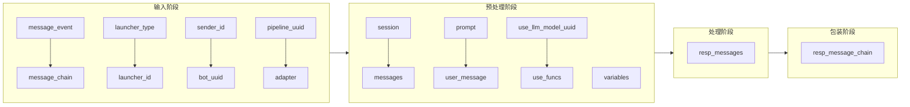
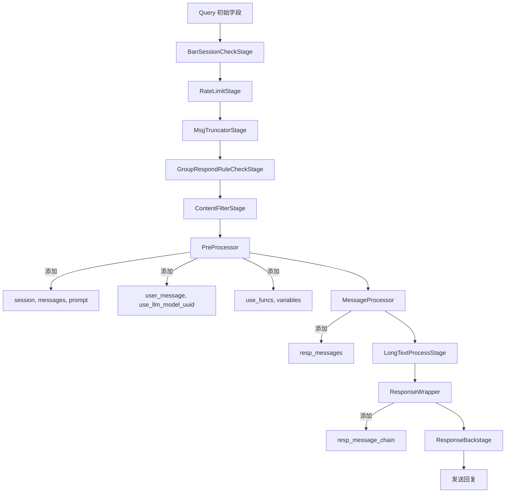

# LangBot 流水线(Pipeline)通信机制详细分析

> 本报告深入分析 LangBot 中流水线如何接收消息、处理消息、发送回复，以及各阶段如何传递和转换字段。

---

## 一、核心概念

| 概念 | 说明 |
|------|------|
| **Pipeline (流水线)** | 传统的消息处理管道，由多个 Stage 组成，处理用户消息并生成回复 |
| **Query** | 一次请求的上下文封装，是整个流水线的核心通信载体 |
| **Stage** | 流水线处理阶段，每个阶段负责特定任务，通过责任链模式串联 |
| **StageProcessResult** | Stage 处理结果，包含是否继续、新Query对象、通知信息 |

---

## 二、Query 对象：流水线的核心通信载体

### 2.1 Query 完整字段定义

Query 对象定义在 `langbot_plugin/api/entities/builtin/pipeline/query.py`，是整个流水线的核心通信载体。

```python
class Query(pydantic.BaseModel):
    # ====== 输入字段（来自Platform） ======
    query_id: int                              # 请求ID，QueryPool生成
    launcher_type: LauncherTypes               # 会话类型(person/group)
    launcher_id: int | str                     # 会话ID(群号/用户ID)
    sender_id: int | str                       # 发送者ID
    message_event: MessageEvent                # 原始事件对象
    message_chain: MessageChain                # 原始消息链
    adapter: AbstractMessagePlatformAdapter    # 消息平台适配器对象
    bot_uuid: str | None                       # 机器人UUID
    pipeline_uuid: str | None                  # 流水线UUID
    
    # ====== 处理字段（由Stage填充） ======
    pipeline_config: dict | None               # 流水线配置(Pipeline.run设置)
    session: Session | None                    # 会话对象(PreProcessor设置)
    messages: list[Message|MessageChunk]       # 历史消息列表(PreProcessor设置)
    prompt: Prompt | None                      # 情景预设(PreProcessor设置)
    user_message: Message|MessageChunk         # 用户消息对象(PreProcessor设置)
    variables: dict[str, Any]                  # 变量字典(各Stage传递数据)
    use_llm_model_uuid: str | None             # 使用的模型UUID(PreProcessor设置)
    use_funcs: list[LLMTool]                   # 使用的函数工具(PreProcessor设置)
    
    # ====== 输出字段（由Process阶段生成） ======
    resp_messages: list[Message|MessageChain]  # 回复消息对象列表
    resp_message_chain: list[MessageChain]     # 回复消息链(Wrapper生成)
    
    # ====== 内部字段 ======
    current_stage_name: str | None             # 当前阶段名称
```

### 2.2 Variables 字典中的内部字段

这些字段通过 `query.variables` 字典传递，是隐式通信的关键：

| 变量名 | 设置位置 | 用途 |
|--------|----------|------|
| `_routed_by_rule` | QueryPool.add_query | 是否通过路由规则选择流水线 |
| `_pipeline_bound_plugins` | RuntimePipeline.run | 绑定到此流水线的插件列表 |
| `_pipeline_bound_mcp_servers` | RuntimePipeline.run | 绑定到此流水线的MCP服务器列表 |
| `_monitoring_bot_name` | RuntimePipeline.run | 监控用的机器人名称 |
| `_monitoring_pipeline_name` | RuntimePipeline.run | 监控用的流水线名称 |
| `_monitoring_message_id` | PipelineManager.process_query | 监控消息ID |
| `_monitoring_has_error` | PipelineManager._check_output | 是否发生错误标记 |
| `_fallback_model_uuids` | PreProcessor | 回退模型UUID列表 |
| `_knowledge_base_uuids` | PreProcessor | 知识库UUID列表 |
| `user_message_text` | PreProcessor | 用户消息纯文本 |

---

## 三、消息接收：从平台到 Query

### 3.1 接收链路

```
Platform Adapter → BotManager → MessageAggregator → QueryPool
```

### 3.2 各阶段字段处理

#### 3.2.1 BotManager 阶段

位置：`pkg/platform/botmgr.py`

**接收的字段**：
- `event`: 平台原始事件
- `bot_entity`: 机器人实体(包含 `use_pipeline_uuid`)

**处理的字段**：
```python
# 解析流水线UUID
pipeline_uuid, routed_by_rule = self.resolve_pipeline_uuid(
    session_type='person'|'group',
    launcher_id=launcher_id,
    message_text=message_text
)
```

**流水线路由规则**：
```python
def resolve_pipeline_uuid(self, session_type, launcher_id, message_text):
    # 1. 检查流水线路由规则
    for rule in self.bot_entity.pipeline_routing_rules:
        rule_type = rule.get('type')      # 'prefix', 'regexp', 'random'
        rule_value = rule.get('value', '')
        target_uuid = rule.get('pipeline_uuid')
        # 匹配则返回 target_uuid
    
    # 2. 回退到默认
    return self.bot_entity.use_pipeline_uuid, False
```

**Webhook 跳过机制**：
```python
skip_pipeline = await self.ap.webhook_pusher.push_person_message(...)
if skip_pipeline:
    # 跳过流水线处理
```

#### 3.2.2 MessageAggregator 阶段

位置：`pkg/pipeline/aggregator.py`

**功能**：消息聚合/防抖

**接收的字段**：
- `bot_uuid`, `launcher_type`, `launcher_id`, `sender_id`
- `message_event`, `message_chain`, `adapter`
- `pipeline_uuid`, `routed_by_rule`

**配置读取**：
```python
aggregation_config = pipeline_config.get('trigger', {}).get('message-aggregation', {})
enabled = aggregation_config.get('enabled', False)
delay = aggregation_config.get('delay', 1.5)  # 秒
```

**消息合并逻辑**：
```python
def _merge_messages(self, messages: list[PendingMessage]) -> PendingMessage:
    # 使用第一条消息作为基础
    base_msg = messages[0]
    # 合并所有消息链，用换行符分隔
    merged_chain = MessageChain([])
    for msg in messages:
        merged_chain.append(Plain(text='\n'))  # 分隔符
        for component in msg.message_chain:
            merged_chain.append(component)
    return PendingMessage(..., message_chain=merged_chain, ...)
```

#### 3.2.3 QueryPool 阶段

位置：`pkg/pipeline/pool.py`

**创建的 Query 对象**：
```python
query = pipeline_query.Query(
    bot_uuid=bot_uuid,
    query_id=query_id,                    # 自增计数器
    launcher_type=launcher_type,
    launcher_id=launcher_id,
    sender_id=sender_id,
    message_event=message_event,
    message_chain=message_chain,
    variables={'_routed_by_rule': routed_by_rule},  # 初始变量
    resp_messages=[],                     # 空列表
    resp_message_chain=[],                # 空列表
    adapter=adapter,
    pipeline_uuid=pipeline_uuid,
)
```

---

## 四、消息处理：Stage 链式执行

### 4.1 控制器调度

位置：`pkg/pipeline/controller.py`

```python
async def consumer(self):
    while True:
        # 1. 从QueryPool获取请求
        async with self.ap.query_pool:
            for query in queries:
                session = await self.ap.sess_mgr.get_session(query)
                if not session._semaphore.locked():  # 会话未达并发上限
                    selected_query = query
                    await session._semaphore.acquire()
                    break
        
        # 2. 查找对应流水线
        pipeline = await self.ap.pipeline_mgr.get_pipeline_by_uuid(pipeline_uuid)
        
        # 3. 执行流水线
        await pipeline.run(selected_query)
```

### 4.2 流水线执行

位置：`pkg/pipeline/pipelinemgr.py`

```python
async def run(self, query: pipeline_query.Query):
    # 1. 设置流水线配置到Query
    query.pipeline_config = self.pipeline_entity.config
    
    # 2. 存储绑定插件列表到variables
    query.variables['_pipeline_bound_plugins'] = self.bound_plugins
    query.variables['_pipeline_bound_mcp_servers'] = self.bound_mcp_servers
    
    # 3. 准备监控元数据
    query.variables['_monitoring_bot_name'] = bot_name
    query.variables['_monitoring_pipeline_name'] = self.pipeline_entity.name
    
    # 4. 执行Stage链
    await self.process_query(query)
```

### 4.3 Stage 责任链执行机制

位置：`pkg/pipeline/pipelinemgr.py:206`

```python
async def _execute_from_stage(self, stage_index: int, query: pipeline_query.Query):
    i = stage_index
    while i < len(self.stage_containers):
        stage_container = self.stage_containers[i]
        query.current_stage_name = stage_container.inst_name
        
        # 调用stage.process
        result = stage_container.inst.process(query, stage_container.inst_name)
        
        if isinstance(result, pipeline_entities.StageProcessResult):
            if result.result_type == INTERRUPT:
                break  # 中断
            elif result.result_type == CONTINUE:
                query = result.new_query  # 更新query
        elif isinstance(result, typing.AsyncGenerator):
            async for sub_result in result:
                if sub_result.result_type == CONTINUE:
                    query = sub_result.new_query
                    await self._execute_from_stage(i + 1, query)  # 递归执行后续stage
            break
        i += 1
```

**关键理解**：
- Stage 可以返回 `StageProcessResult` 或 `AsyncGenerator[StageProcessResult]`
- 如果返回生成器，每次生成结果后会**递归执行后续Stage**
- 这实现了流式输出时每个chunk都经过完整Stage链

### 4.4 StageProcessResult 结构

位置：`pkg/pipeline/entities.py`

```python
class StageProcessResult:
    result_type: ResultType          # CONTINUE 或 INTERRUPT
    new_query: Query                 # 处理后的Query对象
    
    # 可选的通知字段
    user_notice: str | MessageChain  # 用户可见通知
    debug_notice: str                # 调试通知
    console_notice: str              # 控制台通知
    error_notice: str                # 错误通知
```

---

## 五、各 Stage 的字段处理详解

### 5.1 Stage 执行顺序和字段影响

| 阶段 | 名称 | 读取字段 | 写入/修改字段 | 中断条件 |
|------|------|----------|---------------|----------|
| 1 | BanSessionCheckStage | `pipeline_config.trigger.access-control` | - | 会话被禁止 |
| 2 | RateLimitStage | `pipeline_config.rate-limit` | - | 超出速率限制 |
| 3 | MsgTruncatorStage | `pipeline_config.msg-truncate` | `query.messages` | - |
| 4 | GroupRespondRuleCheckStage | `pipeline_config.trigger.group-respond-rules` | - | 不匹配响应规则 |
| 5 | ContentFilterStage | `pipeline_config.content-filter` | `query.message_chain` | 内容被过滤 |
| 6 | **PreProcessor** | `query.message_chain`, `query.session` | `query.session`, `query.messages`, `query.prompt`, `query.user_message`, `query.use_llm_model_uuid`, `query.use_funcs`, `query.variables` | - |
| 7 | **MessageProcessor** | `query.message_chain`, `query.prompt`, `query.messages`, `query.user_message` | `query.resp_messages`, `query.session.using_conversation.messages` | LLM调用失败 |
| 8 | LongTextProcessStage | `query.resp_message_chain`, `pipeline_config.output.long-text-processing` | `query.resp_message_chain` | - |
| 9 | **ResponseWrapper** | `query.resp_messages` | `query.resp_message_chain` | 事件阻止默认 |
| 10 | ResponseBackstage | `query.resp_message_chain` | - | - |

### 5.2 PreProcessor 阶段（预处理）

位置：`pkg/pipeline/preproc/preproc.py`

**读取的字段**：
```python
query.pipeline_config['ai']['runner']['runner']  # 选择运行器
query.pipeline_config['ai']['local-agent']['model']  # 模型配置
query.message_chain  # 用户消息链
query.message_event  # 原始事件
query.pipeline_uuid  # 流水线UUID
query.bot_uuid  # 机器人UUID
query.variables  # 变量字典
```

**写入的字段**：
```python
# 会话管理
query.session = session  # 设置会话对象

# 对话上下文
query.prompt = conversation.prompt.copy()  # 情景预设
query.messages = conversation.messages.copy()  # 历史消息

# 模型配置
query.use_llm_model_uuid = llm_model.model_entity.uuid  # 模型UUID
query.use_funcs = await self.ap.tool_mgr.get_all_tools(...)  # 函数工具列表

# 变量更新
query.variables.update({
    'launcher_type': query.session.launcher_type.value,
    'launcher_id': query.session.launcher_id,
    'sender_id': query.sender_id,
    'session_id': f'{query.session.launcher_type.value}_{query.session.launcher_id}',
    'conversation_id': conversation.uuid,
    'msg_create_time': int(query.message_event.time) if query.message_event.time else ...,
    'group_name': ...,
    'sender_name': sender_name,
})

# 回退模型
query.variables['_fallback_model_uuids'] = valid_fallbacks

# 知识库
query.variables['_knowledge_base_uuids'] = list(kb_uuids)

# 用户消息纯文本
query.variables['user_message_text'] = plain_text

# 用户消息对象
query.user_message = provider_message.Message(role='user', content=content_list)
```

**事件触发**：
```python
# 触发 PromptPreProcessing 事件
event = events.PromptPreProcessing(
    session_name=f'{query.session.launcher_type.value}_{query.session.launcher_id}',
    default_prompt=query.prompt.messages,
    prompt=query.messages,
    query=query,
)
event_ctx = await self.ap.plugin_connector.emit_event(event, bound_plugins)

# 插件可修改的字段
query.prompt.messages = event_ctx.event.default_prompt  # 修改情景预设
query.messages = event_ctx.event.prompt  # 修改历史消息
```

### 5.3 MessageProcessor 阶段（核心处理）

位置：`pkg/pipeline/process/process.py`

```python
async def process(self, query, stage_inst_name):
    message_text = str(query.message_chain).strip()
    
    # 根据命令前缀选择处理器
    if message_text.startswith(cmd_prefix):
        handler_to_use = self.cmd_handler
    else:
        handler_to_use = self.chat_handler
    
    async for result in handler_to_use.handle(query):
        yield result
```

### 5.4 ChatMessageHandler 处理流程

位置：`pkg/pipeline/process/handlers/chat.py`

**读取的字段**：
```python
query.launcher_type           # 会话类型
query.launcher_id             # 会话ID
query.sender_id               # 发送者ID
query.message_chain           # 用户消息
query.pipeline_config         # 流水线配置
query.session                 # 会话对象
query.messages                # 历史消息
query.prompt                  # 情景预设
query.user_message            # 用户消息对象
query.use_llm_model_uuid      # 模型UUID
query.use_funcs               # 函数工具
query.variables               # 变量(获取绑定插件)
query.adapter                 # 适配器(检查流式支持)
```

**写入的字段**：
```python
# 添加AI回复
query.resp_messages.append(result)

# 保存对话历史
query.session.using_conversation.messages.append(query.user_message)  # 保存用户消息
query.session.using_conversation.messages.extend(query.resp_messages) # 保存AI回复
```

**事件触发**：
```python
# 1. 触发 NormalMessageReceived 事件
event = PersonNormalMessageReceived|GroupNormalMessageReceived(
    text_message=str(query.message_chain),
    message_event=query.message_event,
    message_chain=query.message_chain,
    query=query,
)
event_ctx = await self.ap.plugin_connector.emit_event(event, bound_plugins)

# 事件可修改的字段：
event_ctx.event.reply_message_chain    # 回复消息链(阻止默认时返回)
event_ctx.event.user_message_alter     # 修改用户消息内容
```

**流式输出处理**：
```python
if is_stream:
    resp_message_id = uuid.uuid4()
    async for result in runner.run(query):
        result.resp_message_id = str(resp_message_id)
        query.resp_messages.pop()          # 移除旧结果
        query.resp_messages.append(result) # 添加新结果
        yield StageProcessResult(CONTINUE, query)  # 每个chunk都yield
else:
    async for result in runner.run(query):
        query.resp_messages.append(result)
        yield StageProcessResult(CONTINUE, query)
```

### 5.5 CommandHandler 处理流程

位置：`pkg/pipeline/process/handlers/command.py`

**读取的字段**：
```python
query.message_chain           # 用户消息(命令文本)
query.launcher_type           # 会话类型
query.launcher_id             # 会话ID
query.sender_id               # 发送者ID
query.variables               # 变量(获取绑定插件)
```

**写入的字段**：
```python
query.resp_messages.append(
    provider_message.Message(
        role='command',
        content=content,  # 命令执行结果
    )
)
```

**事件触发**：
```python
event = PersonCommandSent|GroupCommandSent(
    command=spt[0],
    params=spt[1:] if len(spt) > 1 else [],
    is_admin=(privilege == 2),
    query=query,
)
event_ctx = await self.ap.plugin_connector.emit_event(event, bound_plugins)

# 事件可修改的字段：
event_ctx.event.reply_message_chain    # 回复消息链(阻止默认时返回)
```

### 5.6 ResponseWrapper 阶段

位置：`pkg/pipeline/wrapper/wrapper.py`

**功能**：将 `resp_messages` 转换为 `resp_message_chain`

```python
async def process(self, query, stage_inst_name):
    if isinstance(query.resp_messages[-1], MessageChain):
        # 已经是MessageChain，直接使用
        query.resp_message_chain.append(query.resp_messages[-1])
    else:
        if query.resp_messages[-1].role == 'command':
            query.resp_message_chain.append(
                query.resp_messages[-1].get_content_platform_message_chain(prefix_text='[bot] ')
            )
        elif query.resp_messages[-1].role == 'plugin':
            query.resp_message_chain.append(
                query.resp_messages[-1].get_content_platform_message_chain()
            )
        elif query.resp_messages[-1].role == 'assistant':
            # 触发 NormalMessageResponded 事件
            event = NormalMessageResponded(
                response_text=reply_text,
                funcs_called=[fc.function.name for fc in result.tool_calls],
                query=query,
            )
            event_ctx = await self.ap.plugin_connector.emit_event(event, bound_plugins)
            
            if event_ctx.is_prevented_default():
                yield StageProcessResult(INTERRUPT, query)
            else:
                if event_ctx.event.reply_message_chain:
                    query.resp_message_chain.append(event_ctx.event.reply_message_chain)
                else:
                    query.resp_message_chain.append(result.get_content_platform_message_chain())
```

---

## 六、消息发送：从 Query 到平台

### 6.1 输出检查机制

位置：`pkg/pipeline/pipelinemgr.py:140`

```python
async def _check_output(self, query, result):
    if result.user_notice:
        # 处理通知内容
        if isinstance(result.user_notice, str):
            result.user_notice = MessageChain([Plain(text=result.user_notice)])
        
        # @发送者(群聊)
        if query.pipeline_config['output']['misc']['at-sender']:
            result.user_notice.insert(0, At(target=query.message_event.sender.id))
        
        # 流式输出 vs 普通回复
        if await query.adapter.is_stream_output_supported():
            await query.adapter.reply_message_chunk(
                message_source=query.message_event,
                bot_message=query.resp_messages[-1],
                message=result.user_notice,
                quote_origin=query.pipeline_config['output']['misc']['quote-origin'],
                is_final=[msg.is_final for msg in query.resp_messages][0],
            )
        else:
            await query.adapter.reply_message(
                message_source=query.message_event,
                message=result.user_notice,
                quote_origin=query.pipeline_config['output']['misc']['quote-origin'],
            )
```

### 6.2 适配器接口

适配器接口定义在 `langbot_plugin/api/definition/abstract/platform/adapter.py`：

```python
class AbstractMessagePlatformAdapter:
    async def reply_message(self, message_source, message, quote_origin): ...
    async def reply_message_chunk(self, message_source, bot_message, message, quote_origin, is_final): ...
    async def create_message_card(self, message_id, message_source): ...
    async def is_stream_output_supported(self) -> bool: ...
```

---

## 七、Pipeline 配置结构

### 7.1 配置元数据

位置：`pkg/core/stages/load_config.py`

```python
ap.pipeline_config_meta_trigger = load_yaml('metadata/pipeline/trigger.yaml')
ap.pipeline_config_meta_safety = load_yaml('metadata/pipeline/safety.yaml')
ap.pipeline_config_meta_ai = load_yaml('metadata/pipeline/ai.yaml')
ap.pipeline_config_meta_output = load_yaml('metadata/pipeline/output.yaml')
```

### 7.2 配置结构示例

```json
{
  "trigger": {
    "group-respond-rules": [...],
    "access-control": {
      "mode": "whitelist|blacklist|...",
      "whitelist": [...],
      "blacklist": [...]
    },
    "message-aggregation": {
      "enabled": false,
      "delay": 1.5
    }
  },
  "safety": {
    "content-filter": {...},
    "rate-limit": {...}
  },
  "ai": {
    "runner": {
      "runner": "local-agent"
    },
    "local-agent": {
      "model": {
        "primary": "model-uuid"
      },
      "knowledge-bases": ["kb-uuid-1", "kb-uuid-2"]
    }
  },
  "output": {
    "long-text-processing": {
      "strategy": "forward|image",
      "threshold": 2500,
      "font-path": "..."
    },
    "misc": {
      "at-sender": false,
      "quote-origin": false,
      "track-function-calls": true,
      "exception-handling": "show-hint|show-error|hide",
      "failure-hint": "Request failed."
    }
  }
}
```

---

## 八、插件与流水线的通信

### 8.1 事件系统

| 事件名称 | 触发时机 | 可修改字段 |
|----------|----------|------------|
| `PersonMessageReceived` / `GroupMessageReceived` | 消息进入流水线时 | 阻止默认行为 |
| `PersonNormalMessageReceived` / `GroupNormalMessageReceived` | LLM调用前 | `reply_message_chain`, `user_message_alter` |
| `NormalMessageResponded` | LLM调用后，发送回复前 | `reply_message_chain` |
| `PersonCommandSent` / `GroupCommandSent` | 命令执行时 | `reply_message_chain` |
| `PromptPreProcessing` | 预处理阶段 | `default_prompt`, `prompt` |

### 8.2 插件 API

通过 `query.variables` 传递的插件相关字段：

```python
# 获取绑定插件列表
bound_plugins = query.variables.get('_pipeline_bound_plugins', None)

# 设置/获取自定义变量
query.set_variable('key', value)
value = query.get_variable('key')
variables = query.get_variables()
```

---

## 九、监控字段传递

### 9.1 监控数据流

```
Pipeline.run() → 设置 _monitoring_bot_name, _monitoring_pipeline_name
    → process_query() → 记录 message_id
    → 各Stage → 设置 _monitoring_has_error
    → 最终 → 记录成功/失败
```

### 9.2 监控字段汇总

| 字段 | 类型 | 设置位置 |
|------|------|----------|
| `_monitoring_bot_name` | string | RuntimePipeline.run |
| `_monitoring_pipeline_name` | string | RuntimePipeline.run |
| `_monitoring_message_id` | string | PipelineManager.process_query |
| `_monitoring_has_error` | boolean | PipelineManager._check_output |

---

## 十、关键通信模式总结

### 10.1 字段传递模式

1. **直接修改 Query 对象**：Stage 直接修改 `query.field_name`
2. **Variables 字典**：通过 `query.variables[key]` 传递隐式数据
3. **Result 包装**：通过 `StageProcessResult(new_query=query)` 传递修改后的Query
4. **事件系统**：通过 `emit_event` 让插件修改事件对象的字段

### 10.2 中断模式

1. **INTERRUPT**：立即停止流水线执行
2. **CONTINUE**：继续执行下一个Stage
3. **AsyncGenerator**：流式输出，每个结果都触发后续Stage执行

### 10.3 数据流向

```
输入数据流:
message_event → message_chain → (PreProcessor) → messages, prompt, user_message

处理数据流:
messages + prompt + user_message → (Runner) → resp_messages

输出数据流:
resp_messages → (Wrapper) → resp_message_chain → (Adapter) → 平台回复
```

---

## 十一、字段传递详细图

### 11.1 Query 对象字段生命周期



### 11.2 Stage 间字段传递



---

## 十二、WebSocket 特殊处理

### 12.1 WebSocket 适配器

位置：`pkg/platform/sources/websocket_adapter.py`

**特殊字段**：
```python
message_lists: dict[str, list[WebSocketMessage]]       # {pipeline_uuid: [messages]}
stream_message_indexes: dict[str, dict[str, int]]      # {pipeline_uuid: {resp_message_id: index}}
```

**消息广播**：
```python
await ws_connection_manager.broadcast_to_pipeline(
    pipeline_uuid,
    {
        'type': 'message',
        'data': message_data,
        'session_type': session_type,
    }
)
```

---

## 十三、Workflow 调用 Pipeline 的通信

当 Workflow 中的 `call_pipeline` 节点调用 Pipeline 时：

位置：`pkg/workflow/nodes/call_pipeline.py`

**创建的 Query 对象**：
```python
query = pipeline_query.Query(
    bot_uuid=context.bot_id,
    query_id=-1,  # 特殊标记，表示来自Workflow
    launcher_type=launcher_type,
    launcher_id=launcher_id,
    sender_id=sender_id,
    message_event=message_event,
    message_chain=message_chain,
    variables={
        '_called_from_workflow': True,  # 特殊标记
        '_workflow_execution_id': context.execution_id,
        '_workflow_id': context.workflow_id,
        **dict(context.variables or {}),  # 继承Workflow变量
    },
    resp_messages=[],
    resp_message_chain=[],
    adapter=_WorkflowPipelineCaptureAdapter(context=context),  # 特殊适配器
    pipeline_uuid=pipeline_uuid,
)
```

**特殊适配器**：`_WorkflowPipelineCaptureAdapter`
- 继承自 `AbstractMessagePlatformAdapter`
- 不实际发送消息到平台，而是捕获所有回复
- 提供 `get_last_text_response()` 方法获取最后文本回复
- 提供 `responses` 列表记录所有回复

---

*报告生成时间: 2026-05-20*
*分析基于代码版本: LangBot_copy*
